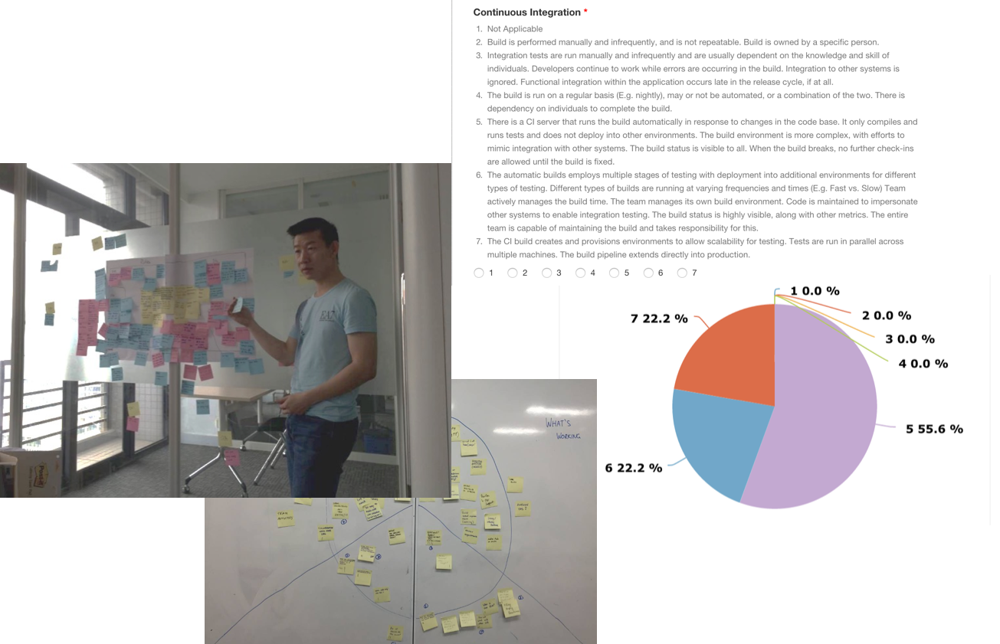
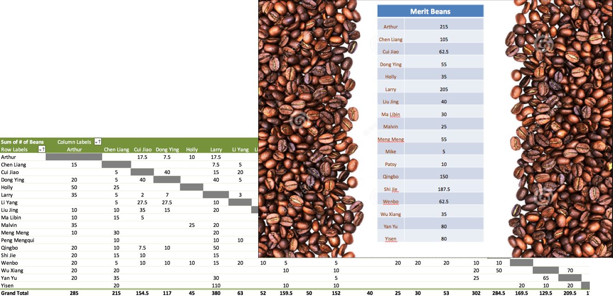
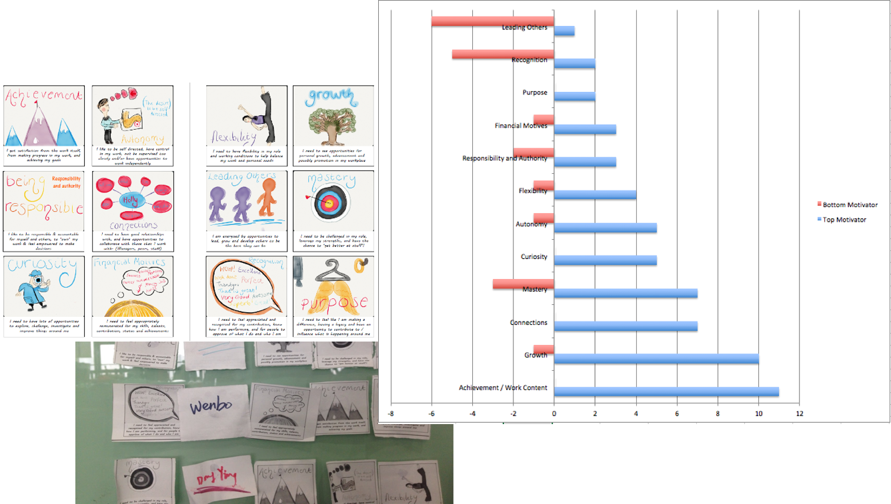
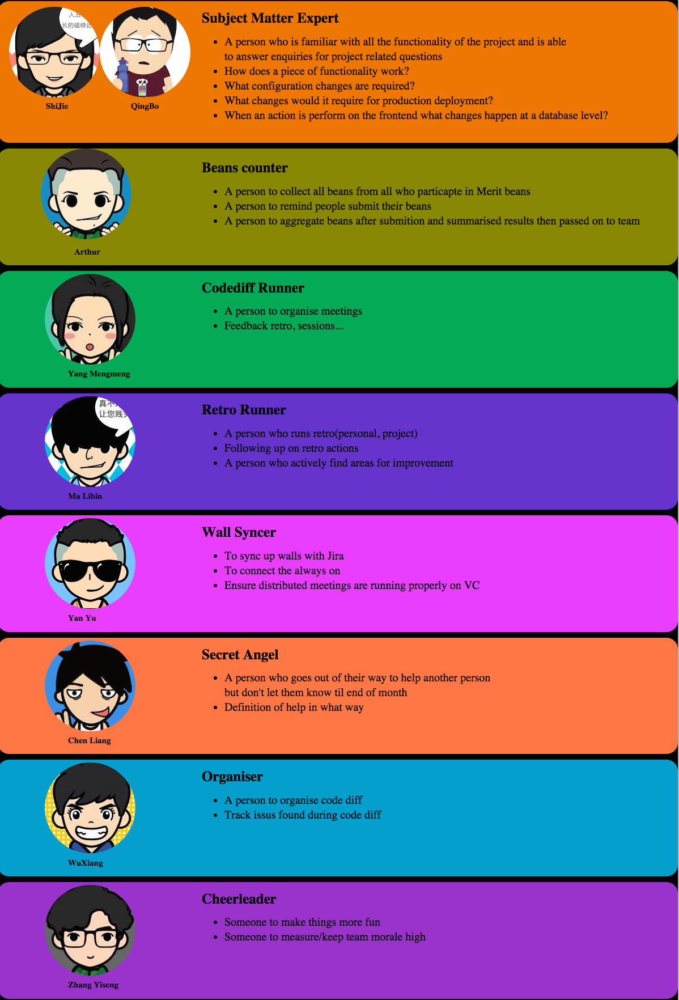
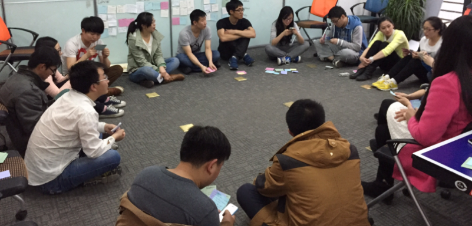
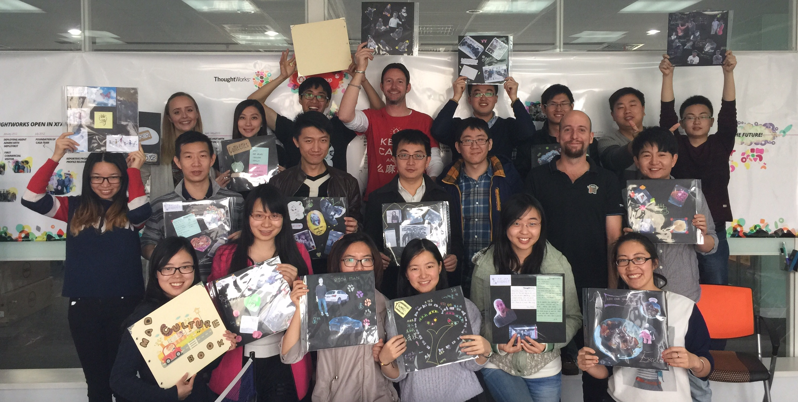

变中求生——频繁变化的团队如何打造团队文化
=========

一、引言
---------

**　　Thought**Works是一家敏捷软件咨询和专业软件交付公司，西安办公室的交付团队规模基本都是十人左右的小团队，每一个交付项目的生命周期一般也都不会超过半年。
随着公司业务规模的不断扩大（从2014年3月，西安办公室从125人增长到现在230+）、新项目快速启动人员持续增长、，每个团队中经验较足的同事会从当前团队Roll off，去重新组建并带领新的交付团队，所以每个项目组人员变化都非常快。
这些交付团队本身规模就不大，随着人员的快速流动，就出现了各种各样的问题，例如团队能力、协作、文化等，团队能力和团队协作/文化也不断变化，同时交付也会出现很多问题。

二、案例分析
----------

　　我们的团队在14年7月时，团队规模为12人，是一个非常优秀的敏捷团队，项目中使用的技术主要是Java和前端技术，使用Scrum为敏捷方法。
可是在后续一年时间的中，项目上6名经验最丰富的同事离开了团队，新补充进来了12人中6人是毕业生，团队的技术底蕴、文化底蕴都受到了很大的冲击。
开发技术也从Java切换到Ruby、NodeJS等，因为增大的进度压力，项目骨干会不自觉的承担更多工作，而新人，尤其是毕业生，自主学习的意识和能力还没有养成，虽然有结对编程等实践帮助，仍然进步缓慢。
同时也出现了因为平均英语水平大幅下降而导致的极度低下的客户沟通问题，英文会议中的团队关注平均时间也就是5至10分钟，只有少数人能继续支持会议。
团队的新Leader其实本身也并没有什么团队管理经验，所有的团队事务都是由Leader发起、组织、主持，很少有精力能够投入一些真正改善团队的活动中。

　　我们最初的目的非常单纯，并没有想着要将团队打造成一个如何如何了不起的团队，只希望团队能够再次成为一个健康、正常工作的自组织敏捷团队。
基于这样单纯的目的，我们在团队中持续推行或者不断尝试新的团队建设相关的实践。

#### 实践一、Retrospective

　　回顾是每一个团队都应该定期开展的活动，本意是通过种种回顾形式唤起大家对团队的集体意识，指出团队或个人在一段时间内的不足并列出对应的行动。
但是很多时候我们都将回顾流于形式，只是走个过场，甚至因为时间紧迫而忽略回顾，这殊为不智。
持续而有效的回顾和反馈，可以保证团队关心生产力和效率，了解团队自身的不足和问题，这将成为团队持续改进的起点。

　　回顾的形式和方法非常多，耳熟能详的就有“Well & Less Well”、“红绿灯检查”、“心情曲线”等。
回顾的关注点也多种多样，除了“项目开发”之外，还可以关注“敏捷成熟度”、“团队角色和职责”、“人员技能提升”等。

　　在坚持回顾的同时，我们需要做的就还有保证回顾的有效性。
还要根据团队建设目标的发展变化，不断调整回顾的关注点和形式，确保回顾能够有针对性地发现团队的缺陷并转化为其他实践。
当然，长期有效的回顾和正确的回顾产出，也能够不断提升团队内部的安全感和信任度。
　　

#### 实践二、Merit Beans

　　这本来是一种通过外部激励来加强团队主动性的实践。
每人每周都有50个虚拟的豆子，可以以任何理由，送任何数量的豆子给团队的其他成员。
例如：“我给清波15个，他帮我的Pair萌萌解决了一个Isolated Scope属性继承的问题”。
每周我们都会对豆子进行统计并公示，而当月的冠军们也能够获得来自项目组的咖啡、礼品等。

　　然而在实践的过程中我们却发现，或许是外部激励来的不够猛烈，根本没人在乎这些激励。
大家在意的其实是“来自于他人的关注和认可”这样的内部激励。

　　因为Merit Beans会隐性地要求团队里的每一个人关注其他人，所以同理，每一个人也在被其他所有人所关注和认可。

　　举个例子，Larry是我们项目组的一名加拿大籍员工，虽然会说中文，虽然工作非常努力，但是他总担心大家会对他有隔阂，怕自己不被团队认可。
在做Merit Beans实践的时候，他却收到了非常非常多的豆子，他发现他做的每一件事都被其他人记住并且认可了，这令他非常感动和鼓舞。

　　于是我们发现，这个实践真正工作的并不是外部激励，而是内在激励，它会对团队内部的集体意识和相互信任产生极大的促进，尤其是对新加入的成员来说。
　　
　　

#### 实践三、Team Feedback

　　这是一种和回顾较为类似的实践。
但是回顾的出发点是团队，往往会回避针对具体个人的问题，否则容易影响回顾的安全度。
而Team Feedback实践则是尽量创造出安全的反馈环境，以一种让人舒服的方式提出和收集针对个人的反馈。

　　反馈实践也是定期进行。
实施时，每人都需要向其他所有人通过写卡片提出反馈，收集反馈后选择其中的一两条展示出来，并给出一些针对性措施。
提出反馈一共进行两轮，第一轮只提正面反馈，通过鼓励和承认营造安全感；第二轮只提负面反馈，通过卡片来加强隐私性。
当然最后也需要确保改进措施能够落在实处。

　　除了通过写卡片的方法，我们也尝试了类似相亲会的“八分钟Feedback”活动：
两两结对，8分钟面对面给出和接受feedback。每8分钟后换人，直至每个人都和其他所有人结对过。
事实证明，若是能将各种实践赋予趣味性，那么效果便会事半功倍。

　　实践的结果非常喜人，通过多次迭代式地进行小组反馈，每个人不仅在反馈中提及的能力有了明显的进步，而且主动收集反馈的意思和接受反馈的能力都有显著的提高。

#### 实践四、Motivation Check

　　了解团队成员所关注的激励方式，形成团队激励图谱。

　　通过多轮排除法，让每个人在“成就感”，“被尊重”，“好奇心”，“自主性”，“交际”，“经济驱动”，“自由”，“领导他人”，“被赞扬”，“能力成长”，“成为专家”，“目标性”等驱动力中选出最能去激励自己的3项以及最不能激励自己的1项并排序，从而得出个人及团队的激励图谱。

　　参考激励图谱，通过集体努力，尽量有计划地为组员提供合适的工作机会和挑战，从而加深成员对团队的认同，同时也能培养个人的相关能力。

　　

#### 实践五、Cakes

　　没错，就是给团队买蛋糕庆祝。任何团队和个人的成就都值得鼓励，团队能力进步、项目里程碑达成、个人做出突出贡献，全都买蛋糕庆祝。
这不仅仅只是通过蛋糕内部鼓励一下团队，也是通过“来一起吃蛋糕吧”的邀请，告诉其他项目组：“看，我们多厉害”，帮助团队在大环境下取得集体荣誉感。

　　每次的庆祝蛋糕，组员们都会邀请其他项目组的同事朋友们一起分享，分享的除了蛋糕，还有整个团队的成功故事。
“你们才几天业务就破万了，好厉害”，“菁姐你ES这么牛，来帮我们解决个难题吧”这样的赞叹才是对团队成功的最大鼓励。

#### 实践六、Session, Workshop & Reading Club

　　为了提高同事们对知识的理解以及自主学习意识，加深团队知识储备的深度和广度，我们在周期性的组织知识分享活动之外，也鼓励自发的知识分享。
知识单元可能小到“运行bundle install时会发生什么”，也可能大到“微服务开发最佳实践”，更甚至会涉及“量子力学初探”。
学习的形式也多种多样，演讲、工坊练习、读书会、英语泛听活动等。

　　不强制制定学习的范围，是为了维护主动分享的乐趣和自发性，如果只限定在工作范围内，知识分享在新人眼里往往会看做一种考核，从而丧失主动性。
长期坚持实践执行的结果就是，在没有做任何强制要求的情况下，每个人也都乐于主动分享自己的知识，各种学习活动会如期展开并经常创新，学习效果也能从多元化的学习方式中得到保障。

#### 实践七、Team Hackday

　　Hackday是一种特殊的编程活动，会定期投入一些时间来完成一些和工作无关或弱相关的编程工作。
这也是**Thought**Works和一些客户每三个月就会定期开展的一项为期两天的实践。
每个人都可以提出自己想要完成的创意，并自己寻找组队队员，一起实现一些很高端很炫酷的东西。
活动旨在鼓励创新，提升设计、编程等方面技能的同时，也给平静的工作生活带来一些新意，如果能够借此孵化出一些新的项目和产品那自然是更好。

　　我们发现，Hackday的确是一种深受大家喜爱的技能提升方法，也有很多有新意的好玩创意因为时间关系没法实现。
大家都希望公司能更多地举行类似的活动，但是由于成本问题无法实现。
那么为何不能由项目组发起，利用非工作时间来开展活动呢？

　　项目组内部的第一个Hackday项目就是“啤酒自动化酿造”。
这是一个结合了硬件、开源硬件、嵌入式开发、云、消息推送、Web开发、工作中使用到的工具等技术完成的啤酒酿造半流水线。
至今已酿可饮用啤酒三批，也大大提高了团队的编程兴趣、编程技能、对工作相关工具和熟悉程度。

　　兴趣与成长想结合，何乐而不为呢？

#### 实践八、Direct Responsibility Individuals

　　在日常工作中有非常多的团队事务，组织站会、组织回顾、代码审核……如果所有的事情都让同一个人来负责，会让他觉得工作非常杂乱，严重影响他的工作进度。
而我们期待的理想状况，是项目组中的每个成员都能主动的承担起一部分团队事务，积极的维持团队工作。

　　DRI既直接责任人，顾名思义，团队中的每一件事都能对应到一个责任人。
随着责任和日常工作的融合，每个人都会在自然而然提升责任感的同事，以身作则地像新人传达责任感。

　　

#### 实践九、Post Incident Reviews

　　项目中总会出现问题，尤其是较为严重的线上问题。在发生“文博手滑清空了生产数据库”这个严重问题后，除了恢复数据库修复问题本身之外，如何在保护当事人的同时归纳总结经验教训，则是另一件重要的事情。

　　Post Incident Reviews就是在问题修复后，针对严重事故的特殊回顾。
回顾上，会从团队集体的角度出发，列出事故发生过程中的重要事件时间点来帮助回忆。
同时需要理清受到事故影响的用户和业务，并分析严重性，再以根因分析法不断演进事故发生的各种原因。
最后要总结应对措施，确保不会再次发生同样的问题。

　　通过PIR，不仅可以通过集体责任来保护当事人，加强内部信任；
可以通过集体危机意识加强个人和团队的责任心；
也能减少再次发生类似问题的可能。

#### 实践十、Remote Team Building

　　我们绝不希望也不能将交付项目做成外包项目，把客户合作做成甲乙方关系。
所以在交付项目中，除了优秀的团队能力、平等的工作合作、稳定的交付能力等要求之外，良好的客户关系也是确保项目成功的一项重要指标。

　　常规的团队建设实践都是能够和其他远程的工作伙伴一起进行的，并不受到地域距离的限制，只有Team Building——其实就是吃喝玩乐——很难一起进行。
很难想象当一群西安的小伙伴自驾去山里烧烤时，如何能让远在千里之外的国外团队也感受到同样地乐趣。
所以如何组织能够远程分享乐趣的团队活动就成为了一个重要问题。

　　最终我们将目光集中在“通过视频会议一起玩各种以沟通和交流为主的有趣游戏”上。
例如加深敏捷实践的乐高游戏，颠倒工作中的角色，PO来做DEV，QA扮演UX，进行一次基于乐高的敏捷工程开发；
例如提高语言技巧的故事游戏，双方利用手边的素材轮流发言，共同完成一个传奇般的故事。
任何有趣并且能加强沟通的游戏都可以作为远程团建的手段。

　　远程团建弥补了分布式团队建设生命周期中缺少的一环，分享了快乐的同时，加深了分布式团队之间的认知和人际关系。

三、团队文化总结
----------

　　团队文化是指团队成员在相互合作的过程中，为实现各自的目标及价值，并为完成团队共同目标而形成的一种潜意识文化。

　　团队文化可以包含价值观、最高目标、行为准则、管理制度、道德风尚等内容。它以全体员工为工作对象，以最大限度地统一成员价值观，凝聚力量，为团队总目标服务。

　　通过持续不断的实践，的确能够进行有效地团队建设。但是随着团队能力、自我管理改善达到一定程度时，会发现越来越难“管理”团队（不同意见太多、决定难做、众口难调、只有讨论没有行动等等）
　　
　　“上帝说，要有光，便有了光”。对于团队来说，文化这束光，便是团队走出混沌，走向自组织的向导。这束光，是团队自己定义的。
　　
　　在我们这个团队，经历了这些问题、困惑、改进、感悟后，一起组织了一次团队文化的workshop。这个workshop的目的是让大家回顾并对比过去，感受团队的发展变化，定义在这个团队中，有哪些共同的特质或者感受是大家所珍视的、能帮助团队朝大家所期望的方向发展的、希望以后能在团队中继续发扬光大的。

　　在一次两岸分布式团队大部分人齐聚一地的时候，在一面贴满了回忆照片的墙面前，大家一起坐下来，分享并回顾在这个团队中所深受感动的人和事，并给每件事贴上自己感受较深的关键词如家、敬业、牛逼、笑声等等。　　
	

　　当把所有关键词分类并精炼概括后，就可以找到团队的“文化”。最后，大家集思广益，用喜欢的形式和方式，将这些文化、故事表现出来，加上注解，就形成了自己的“Culture Book”。这一点上，我们借鉴了[Zappos](http://www.zapposinsights.com/culture-book)公司。	

　　在制作Culture Book之前，我们并不清楚能否做成，最开始也只是想找到团队自己的文化定义，并没有预期到，最终会有这么一本culture book诞生。

　　这样的一件事情，会给团队带来什么样的正面影响？在交付压力巨大的情况下，团队成员是否愿意花时间做这样的事情？所以这件事，也是跟其他实践一样，先有个想法，找几个人聊一聊，听听大家意见，然后任务分解，小步快跑，看看团队成员反映，然后进行下一步。在最开始的过程中，确实有成员不愿意参加，想着要赶紧去写代码赶交付，但是在试了第一个阶段：看照片分享回忆之后，根本停不下来！甚至在既定时间内，没有完成culture book的制作时，大家纷纷主动领硬卡纸，在下班后，三三两两聚在一起花了很多时间去构思怎么才能把它做得更完美。

　　实践证明，在小团队中，要推行什么实践，要做什么事情，从一开始就做一个完美、缜密的计划然后按部就班去实行，是不可取的。在自组织的小团队中，只需要告诉大家，想法是什么，为什么要做，能解决什么问题或者能带来什么价值，然后怎么做，什么时候做，产出是什么，所有的这些，团队会给你最合适的答案。

　　以下便是这个团队的文化定义：　
  
  - Collaboration
  - Respect
  - Happy
  - Family
  - Excellence

　　每个团队都有自己的性格，有自己的文化。这些文化，是在平常一点一滴积累而来，并不会有人说我们要什么样的文化，便会有什么样的文化。文化是一种沉淀和积累，只有整个团队一起共同努力、共同经历后，才会形成团队自己的味道，自己的文化。

四、团队建设宣言
----------
　　我们一直在实践中探寻更好的团队建设方法，身体力行的同时也帮助他人。由此我们建立了如下团队建设宣言：

* #### 内在激励 高于 外部激励
* #### 我要做 高于 要我做
* #### 自我驱动的团队 高于 经验丰富的领导
* #### 个人能力 高于 职责要求
* #### 团队关系 高于 工作合作

也就是说，尽管右项有其价值，我们更重视左项的价值。
